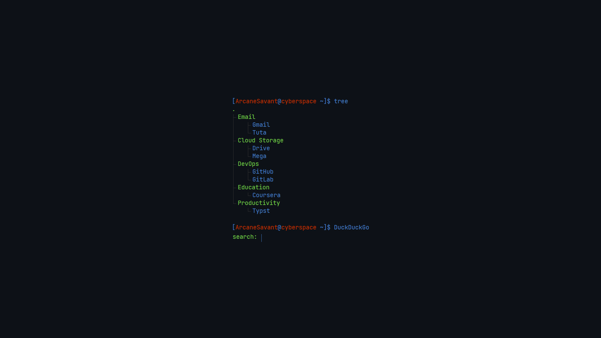

<!-- cspell:words ArcaneSavant nytly startpage -->

# Term-tree

Term-tree is a basic terminal-like startpage with tree structure.

## Authors

ArcaneSavant (@ArcaneSavant) and the [contributors](https://github.com/ArcaneSavant/term-tree/graphs/contributors).

## Features

- Supports Firefox and Chromium
- Optimized for Speed
- Cross Platform
- Mobile Friendly

## Screenshots

## Demo

Live Demo for Term-tree is [available here](https://ArcaneSavant.github.io/term-tree/).

## Contributing

Contributions are always welcome.

Check out the [Contribution Guide](./CONTRIBUTING.md) for more info.

## Support

Feel free to [open an issue](https://github.com/ArcaneSavant/term-tree/issues/new/choose) if you encounter any problem related to _Term-tree_.

## License

_Term-tree_ is released under the [GPLv3 License](./LICENSE).

## Acknowledgements

|               Author                | Repo                             |
| :---------------------------------: | :------------------------------- |
| [nytly](https://notabug.org/nytly/) | <https://notabug.org/nytly/home> |

## Appendix

Built with :heart: in Bangladesh.
